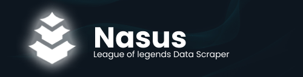

# Nasus



Nasus is a League of Legends Data Scraper that uses the Riot API to gather data on champions, items, and players.
Nasus provides all the data to use in Sion, a League of Legends Statistics and Analysis tool.

## Installation

We use Bun, a Javascript runtime environment to run Nasus. To read more about Bun, visit the [Bun Documentation](https://bun.sh/).

Clone the repository and install the dependencies:

```shell
bun install
```

## Prerequisites

### Riot API Key
To use Nasus, you need to have a **Riot API key**. You can get one by visiting the [Riot Developer Portal](https://developer.riotgames.com/).
Put your API key in the .env file in the root directory of the project.

### MongoDB
In adition, Nasus use **MongoDB** to store the data. You need to have a MongoDB server running on your machine. You can download MongoDB from the [MongoDB Download Center](https://www.mongodb.com/try/download/community).

### Regions
Nasus currently supports all the regions available in the Riot API. You can change the region in the .env file.

The available regions are:

- BR1 `BRAZIL`
- EUN1  `EUROPE EAST`
- EUW1  `EUROPE WEST`
- JP1 `JAPAN`
- KR `KOREA`
- LA1 `LATIN AMERICA NORTH`
- LA2 `LATIN AMERICA SOUTH`
- NA1 `NORTH AMERICA`
- OC1 `OCEANIA`
- TR1 `TURKEY`
- RU `RUSSIA`
- PH2 `PHILIPPINES`
- SG2 `SINGAPORE`
- TH2 `THAILAND`
- TW2 `TAIWAN`
- VN2 `VIETNAM`

To read more about the regions, visit the [Riot API Documentation](https://developer.riotgames.com/docs/lol).

And the .env file should look like this:

```shell
RIOT_API_KEY=YOUR_RIOT_API_KEY
MONGO_URI=mongodb://localhost:27017/<database> #Important! Include <database>
REGION=LA1
```

## Usage

To run Nasus, use the following command:

```shell
bun run start
```

### How it works

Nasus will fetch a list of 10 recent matches from a initial player. Then, it will fetch the data of all the players in those matches. It will repeat this process for each player in the list, in a recursive way.

You can change the initial player in the `config.ts` file.

## Roadmap

- [x] Fetch data from the Riot API
- [x] Store data in a MongoDB database
- [x] Add error handling and retries
- [x] Add support for more regions
- [ ] Dockerize the application
- [ ] Add tests

> [!NOTE]
> Nasus is not endorsed by Riot Games and does not reflect the views or opinions of Riot Games or anyone officially involved in producing or managing Riot Games properties. Riot Games and all associated properties are trademarks or registered trademarks of Riot Games, Inc
